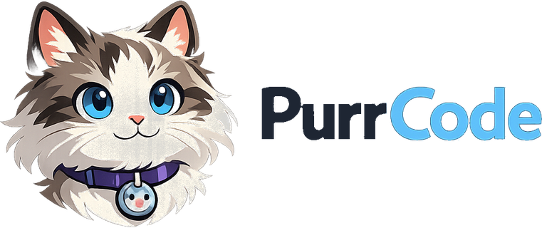

<p align="center">
  <a href="README.md"></a>
</p>

# Providers and Models

PurrCode supports:

- Ollama;
- LM Studio;
- OpenAI;
- OpenAI-compatible APIs;
- enterprise gateways;
- NVIDIA NIM;
- environment-backed credentials;
- operating-system credential stores;
- custom CA bundles;
- proxies;
- mTLS;
- secret-backed headers.

## Provider discovery

Inside the TUI or IDE:

```text
/connect
```

PurrCode probes supported local endpoints and displays observed availability. Local discovery does not generate model output and does not load an unloaded model.

## Import provider configuration

```text
/connect import
```

Supported source formats: Python, JavaScript, TypeScript, cURL, JSON, YAML, TOML, and dotenv. PurrCode parses imported configuration without executing it, and can extract provider type, base URL, model ID, API mode, request defaults, custom headers, authentication configuration, and local-or-remote classification.

### Secret handling during import

Detected secrets remain in transient zeroizing memory until you choose one of:

- store the secret in the operating-system credential store;
- convert it to an environment-variable reference;
- discard it.

Raw secret values are never written into provider configuration or conversation events.

## Manage credentials

```bash
purrcode credential set openai
```

Configuration stores a reference such as `keychain:openai`; the secret itself remains in the operating-system credential store.

## Provider profiles

```text
/provider list
/provider edit <name>
/provider test <name>
/provider remove <name>
```

## Provider diagnostics

```bash
purrcode provider doctor
```

PurrCode classifies provider failures such as connection refused, DNS failure, TLS failure, authentication failure, HTTP error, content-type mismatch, incompatible schema, streaming framing failure, unsupported API mode, model not found, context too large, out of memory, and cancellation.

## Local models

### Ollama

PurrCode supports Ollama's native API and inspects `/api/version`, `/api/tags`, `/api/ps`, and `/api/chat`. Native Ollama mode is separate from OpenAI-compatible mode, so API-mode mismatches are detected instead of surfacing as generic decoding errors.

### LM Studio

PurrCode can discover LM Studio and compatible local endpoints running on loopback. Local-only mode rejects undeclared remote providers and does not silently fall back to cloud inference.

### NVIDIA NIM

`NVIDIA_API_KEY` is detected during onboarding and models are enumerated from the NIM endpoint. NIM is a first-class provider.

### Local model commands

```text
/model recommend
/model qualify <model>
/model loaded
/model unload <model>
/model unload-all
```

Recommendations use observed evidence — model metadata, qualification, physical and available memory, swap pressure, loaded-model memory, context requirements, structured-output reliability, measured latency, and tool-calling support. A model is not recommended only because its name contains terms such as `coder`.

### Pulling a model

When a recommended Ollama model is not installed, PurrCode can propose a governed pull action that requires explicit authorization, uses an exact validated model identifier, reports bounded progress, supports cancellation, and rediscovers models on completion.

### Model lifecycle policies

Supported policies: `unload_after_request`, `idle_timeout`, `keep_loaded`, `external`. Low-memory systems use conservative concurrency and unload behavior. Opening PurrCode does not automatically generate output or load an unloaded model.
